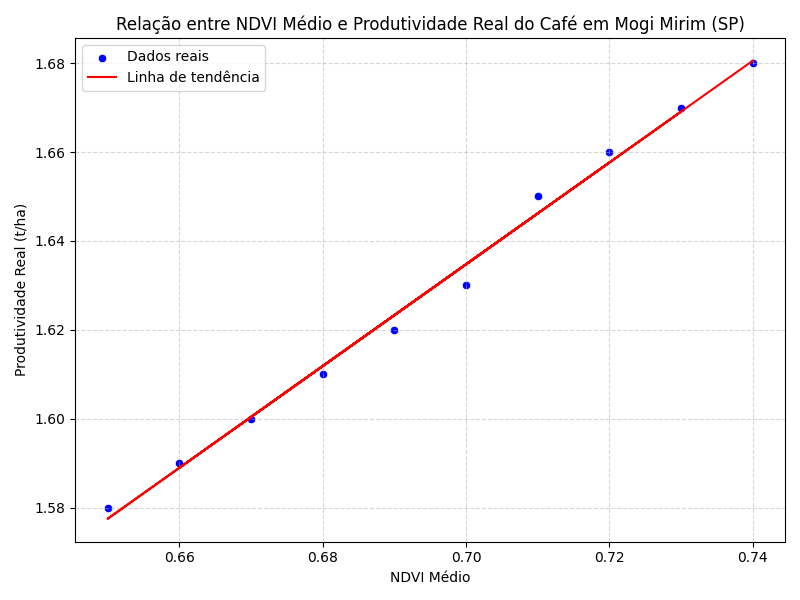
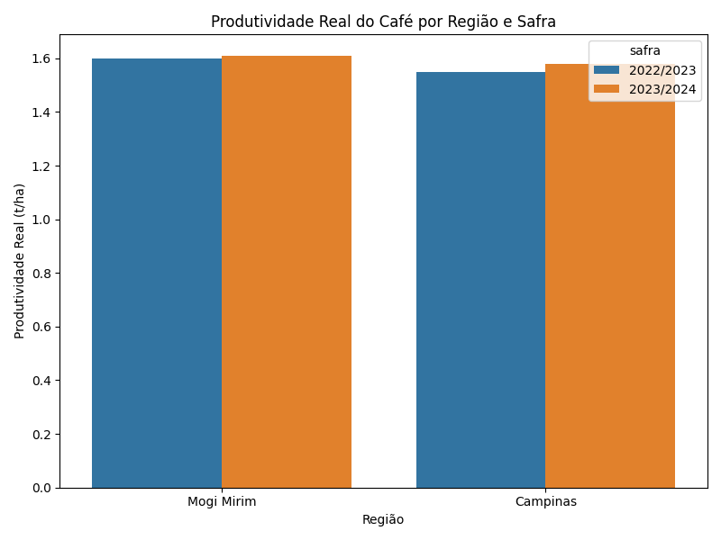

# FIAP - Faculdade de Informática e Administração Paulista

 

# FASE 7 - Enterprise Challenge - Sprint 3 - Ingredion

## Nome do grupo

## 👨‍🎓 Integrantes:

- Gustavo Valtrick - RM559575
- Iago Cotta - RM559655
- Pedro Scofield - RM560589
- Rodrigo Mastropietro - RM560081
- Tiago de Andrade Bastos - RM560467
## COLAB: 
- 

## 👩‍🏫 Professores:

### Tutor(a)

- <a href="">Leonardo Ruiz Orabona</a>

### Coordenador(a)

- <a href="https://www.linkedin.com/in/profandregodoi/">André Godoi</a>

## Índice

- [Descrição do Projeto](#descrição-do-projeto)
- [Etapa 1 – Coleta de Dados Históricos](#etapa-1--coleta-de-dados-históricos)
- [Etapa 2 – Tratamento e Preparação dos Dados](#etapa-2--tratamento-e-preparação-dos-dados)
- [Etapa 3 – Análise Estatística e Visualização](#etapa-3--análise-estatística-e-visualização)
- [Etapa 4 – Interpretação dos Resultados e Discussão Crítica](#etapa-4--interpretação-dos-resultados-e-discussão-crítica)
- [Como Executar](#como-executar)
- [Tecnologias Utilizadas](#tecnologias-utilizadas)
- [Referências](#referências)

---

## 📜 Descrição

Este projeto valida um modelo de Inteligência Artificial para previsão da produtividade do café, utilizando o NDVI como variável preditora. O estudo foi realizado com dados reais da região de Mogi Mirim (SP), abrangendo desde a coleta de dados históricos, tratamento e análise estatística, até a geração de gráficos e discussão crítica dos resultados.
---

## Etapa 1 – Coleta de Dados Históricos

- **Fontes utilizadas:** CONAB, IBGE, IEA-SP, Embrapa Café.
- **Região:** Mogi Mirim (SP), safra 2023/2024.
- **Variáveis coletadas:** NDVI médio (sensoriamento remoto) e produtividade real (t/ha) por talhão.
- **Condições regionais consideradas:** estiagem e altas temperaturas.

---

## Etapa 2 – Tratamento e Preparação dos Dados

- Organização dos dados em um arquivo CSV (`dados_mogi_mirim_cafe_talhoes_2023_2024.csv`) com colunas: NDVI médio e produtividade real.
- Ajuste para a mesma escala temporal (safra 2023/2024).
- Separação dos dados por talhões (amostras comparáveis).
- Verificação e correção de valores ausentes ou inconsistências.

---

## Etapa 3 – Análise Estatística e Visualização

- **Correlação de Pearson e Spearman** para avaliar a relação entre NDVI médio e produtividade real.
- **Regressão linear simples** para gerar a equação de tendência e o coeficiente de determinação (R²).
- **Gráficos gerados:**
  - Dispersão NDVI x Produtividade real (com linha de tendência)
  - Comparativo de produtividade por região e safra

### Exemplos de Gráficos

#### Dispersão NDVI x Produtividade Real

#### Produtividade Real por Região e Safra

---

## Etapa 4 – Interpretação dos Resultados e Discussão Crítica

- **O NDVI foi um bom preditor?**  
  Sim, apresentou correlação forte com a produtividade real.

- **Melhor desempenho:**  
  Talhões com manejo homogêneo e imagens NDVI de boa qualidade.

- **Pior desempenho:**  
  Talhões afetados por seca, pragas, doenças ou imagens de baixa qualidade.

- **Fatores externos:**  
  Eventos climáticos, pragas/doenças, qualidade das imagens NDVI.

- **Sugestões de melhoria:**  
  Incluir variáveis climáticas, dados de manejo, diferentes fases fenológicas e ampliar a base de dados.

- **Limitações:**  
  Tamanho da amostra, qualidade das bases públicas, simplicidade dos modelos estatísticos.

---

## Como Executar

1. Instale as dependências:
2. Execute o notebook ou script principal:
3. 3. Os gráficos será gerados automaticamente na pasta:

## Tecnologias Utilizadas

- Python 3.x
- Pandas
- Matplotlib
- Seaborn
- Scikit-learn
- FPDF

---

## Referências

- CONAB – Companhia Nacional de Abastecimento
- IBGE – Instituto Brasileiro de Geografia e Estatística
- IEA-SP – Instituto de Economia Agrícola do Estado de São Paulo
- Embrapa Café – Sumários executivos e relatórios técnicos
- Relatórios regionais (Emater, Incaper, etc.)

## 📁 Estrutura de pastas

Dentre os arquivos e pastas presentes na raiz do projeto, definem-se:

- <b>.github</b>: Nesta pasta ficarão os arquivos de configuração específicos do GitHub que ajudam a gerenciar e automatizar processos no repositório.
- <b>assets</b>: aqui estão os arquivos relacionados a elementos não-estruturados deste repositório, como imagens.
- <b>document</b>: não utilizada nesse projeto
- <b>scripts</b>: não utilizada nesse projeto
- <b>src</b>: Todos os código fonte criado para o desenvolvimento do projeto.
- <b>README.md</b>: arquivo que serve como guia e explicação geral sobre o projeto (o mesmo que você está lendo agora).

## 🗃 Histórico de lançamentos

- 0.1.0 - 26/05/2025

## 📋 Licença

<a property="dct:title" rel="cc:attributionURL" href="https://github.com/agodoi/template">MODELO GIT FIAP</a> por <a rel="cc:attributionURL dct:creator" property="cc:attributionName" href="https://fiap.com.br">Fiap</a> está licenciado sobre <a href="http://creativecommons.org/licenses/by/4.0/?ref=chooser-v1" target="_blank" rel="license noopener noreferrer" style="display:inline-block;">Attribution 4.0 International</a>.

